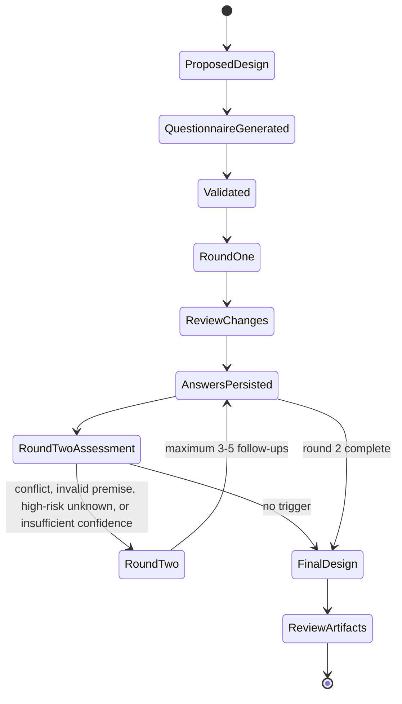

# QuickerGrillMe design specification

## Purpose

QuickerGrillMe is a small decision-review workflow for Agent-assisted software design. It pressure-tests a proposed design without turning the process into exhaustive or adversarial interrogation.

The governing rule is:

> Ask only when plausible answers would materially change the design. Choose a reasonable default otherwise, and expose consequential defaults and uncertainty.

The project is independently designed. It takes brief inspiration from the idea of design “grilling,” but does not reproduce another skill's prompts or text.

## Product principles

1. **Counterfactual value over coverage.** A question earns space only when at least two plausible answers would produce meaningfully different behavior, architecture, cost, risk, or scope.
2. **Recommendations are useful work.** Every question has a preselected Agent recommendation, rationale, and explicit recommendation confidence. A user can submit without editing.
3. **Uncertainty is explicit.** “Defer / unsure” records a temporary default, confidence, and concrete validation trigger. It is not an empty answer.
4. **Short by construction.** Depth caps and stop rules prevent endless questioning. A second round is exceptional, bounded, and risk-driven.
5. **Consequences stay visible.** The final design highlights only defaults that materially affect behavior, cost, or risk. A complete ledger remains available in an appendix.
6. **Core, adapter, and distribution are separate.** Language-neutral JSON artifacts carry questions and answers. User interfaces are adapters. The installable Agent Skill packages the operating instructions and a generated adapter runtime without changing either boundary.
7. **Ordering is semantic.** Questions form a decision dependency DAG, not a flat checklist.
8. **Local-first and inspectable.** The v1 adapter binds to loopback, loads no external services, and writes a readable local artifact.
9. **Fast to the first decision.** The browser UI is compiled and minified before distribution. Skill execution never installs packages or builds frontend code, and the shipped assets have an enforced size budget.

## Workflow and state machine

1. The Agent reads the proposal and emits `questionnaire.json`.
2. Runtime validation checks the contract, references, recommendations, defer defaults, and DAG.
3. The adapter recommends a depth and renders the questionnaire. The user may switch depth before or during completion.
4. Every visible answer starts at the recommendation. Answer changes immediately recompute visibility and page grouping.
5. The review step shows only answers that differ from recommendations, including custom and deferred answers.
6. Submission writes `answers.json`.
7. The Agent assesses the explicit round-two triggers. If needed, it emits one final questionnaire containing no more than 3–5 questions.
8. The Agent produces and persists the final output contract as Markdown.
9. The bundled renderer combines the design, questionnaire, and answers into a self-contained review page.

The browser adapter implements steps 2–6. Generation, round-two reasoning, and final prose remain Agent responsibilities. The dependency-free review renderer persists the final shareable artifact without taking responsibility for hosting or access control. The installable skill tells a compatible Agent how to coordinate the complete workflow and invokes both bundled adapters.

## Installable Agent Skill

`skills/quicker-grill-me/` is the primary end-user distribution. It follows the open Agent Skills layout with `SKILL.md` plus optional scripts, assets, and references, and is installed in one command through the `skills` CLI. The installed directory contains all runtime JavaScript, fixed browser assets, contracts, example, and template needed to run with Node.js; it has no project-local package installation or TypeScript build step.

The committed runtime is generated from `src/`, `public/`, `schema/`, and `examples/` by `tools/sync-skill.mjs`. A deterministic manifest records source mappings and hashes. Contributor checks compare generated files byte-for-byte so the installable package cannot silently drift from the reference implementation.

## Question selection

For each candidate question, the Agent applies this counterfactual test:

1. Identify at least two realistic answers.
2. Describe the design delta caused by each answer.
3. Reject the question if the delta is merely wording, preference, or a reversible implementation detail with no near-term consequence.
4. Keep the question if the delta changes a boundary, hard-to-reverse architecture, core behavior, interface, failure mode, security posture, operating cost, or material delivery risk.
5. If a reasonable default is safe, reversible, and cheap to validate, do not ask. Record it in the default ledger instead.

Selection prioritizes high-impact unresolved decisions, then medium-impact decisions with credible divergent outcomes. Low-impact details are included only at Deep depth and only after prerequisites.

## Depth levels

| Level | Target and hard cap | Intended use |
| --- | --- | --- |
| Essential | 5–7, cap 7 | Early concept, low-risk change, or time-constrained review |
| Standard | 10–15, cap 15 | Default for most feature and system designs |
| Deep | 20–25, cap 25 | High-risk, cross-system, security-sensitive, or hard-to-reverse design |

The Agent recommends a level in questionnaire metadata. The adapter enforces caps after depth filtering, dependency ordering, and visibility evaluation. Conditional questions may make the currently visible count smaller than the target range.

## Decision DAG and ordering

`dependsOn` and visibility-condition references create directed prerequisite edges. The core performs a stable topological sort and rejects cycles.

Among currently eligible nodes, order follows:

1. goals, boundaries, and constraints;
2. high-level hard-to-reverse architecture;
3. interfaces, data flow, and core behavior;
4. failure, security, and operations;
5. reversible implementation details and edge cases.

Within a stage, source topic order keeps related questions contiguous where dependencies allow. An upstream answer change causes visibility to be recalculated. Invalidated downstream questions disappear from the active submission; their local browser state may be retained so changing back does not destroy work.

## Page complexity grouping

The core never encodes a fixed number of questions per page. Each question has a cognitive `complexity` weight from 1 through 5. The adapter groups the ordered visible sequence with a page budget:

- target weight: 4–6;
- typical result: 3–5 simple questions or 1–2 complex questions;
- a page may fall below the target when dependency/topic boundaries and the maximum make a fuller page impossible;
- no question can exceed the adapter's maximum page budget.

The v1 grouping algorithm greedily fills to weight 6, then rebalances a light final page when doing so keeps both pages within budget.

## Recommendations, custom answers, and defer

Each question defines options, a recommended option (or options), recommendation rationale, `recommendationConfidence`, and affected decisions. V1 supports single-choice and multiple-choice questions. A custom answer is allowed only when `allowCustom` is true.

Deferring requires:

- `allowed: true`;
- an explicit temporary option default;
- a validation trigger phrased as an observable event or planned check.

The answer record distinguishes `recommended`, `changed`, `custom`, and `deferred` sources. Confidence belongs only to the Agent recommendation; users choose an answer without rating their own certainty.

## Round two

Round two is generated directly when round-one answers reveal at least one of:

1. two answers that cannot both be satisfied;
2. an answer that invalidates a key premise used to construct the questionnaire;
3. an unresolved high-risk unknown whose plausible outcomes require materially different designs.

A changed recommendation or low recommendation confidence alone is not a trigger. Round two contains 3–5 questions maximum and is the final round. The Agent should prefer a temporary default plus validation plan when another question would not resolve the uncertainty.

## Stop conditions

Stop immediately when all are true:

- the active level cap has been reached or no remaining candidate passes the counterfactual test;
- every high-impact decision is answered or has an explicit temporary default;
- remaining unknowns are reversible or have validation plans;
- no unresolved contradiction remains;
- round two is complete or was not triggered.

Never exceed two rounds. Do not refill a level merely to hit its target count.

## Final output contract

After reading `answers.json`, the Agent produces a complete design document with:

1. goals, scope, and non-goals;
2. architecture, interfaces, data flow, and core behavior;
3. failure handling, security, operations, and validation strategy;
4. a decision summary showing chosen options and material consequences;
5. a main-body **Defaults and assumptions** section containing only defaults that materially affect behavior, cost, or risk;
6. **Deferred validation items**, each with temporary default, owner if known, and trigger;
7. a **Default ledger appendix** containing all defaults, including reversible low-impact choices.

The final document must reconcile answers rather than copy questionnaire text. If round two is required, final generation waits until it is complete.

The Agent must write the complete document to `final-design.md`, then invoke `render-review` to produce `design-review.html`. The HTML presents **Key design decisions** first, followed by the reconciled design. It is self-contained, read-only, and suitable for any static host. Hosting remains an explicit boundary: organization-only or invited-reviewer access must be enforced by the selected publishing platform, not implied by the file.

After generation, the Agent returns the clickable `Questionnaire Results & Design Summary (HTML)` and `Agent Design Plan (Markdown)` links and explains that the Markdown is the editable source for later modification or implementation. Artifact delivery ends the workflow; the Agent must not add a final confirmation question.

## Contracts

The normative language-neutral contracts are:

- [`schema/questionnaire.schema.json`](schema/questionnaire.schema.json)
- [`schema/answers.schema.json`](schema/answers.schema.json)

Runtime validation additionally checks invariants JSON Schema cannot conveniently express:

- globally unique question IDs;
- unique option IDs within a question;
- recommendation and defer-default options exist;
- all dependency and visibility references exist;
- visibility values name options on the referenced question, and `includes` targets only multiple-choice questions;
- no question depends on a prerequisite introduced at a deeper level;
- no self-reference or dependency cycle;
- answer values match known options unless custom input is allowed;
- all visible questions are represented at submission;
- questionnaire identity and version match.

TypeScript types in `src/types.ts` are the reference model, not a replacement for the JSON contracts.
The skill carries generated copies under `skills/quicker-grill-me/references/` so an installer can copy only the skill directory.

## Adapter boundary

An adapter:

1. accepts a validated questionnaire;
2. presents depth selection, recommendations, rationales, defer behavior, and changed-answer review;
3. requests ordered/visible/page-grouped questions from the core rather than duplicating policy;
4. returns a valid answer submission;
5. clearly reports persistence or completion.

Adapters may choose different page budgets and interaction surfaces. They must not raise depth caps, omit explicit defer metadata, reorder dependents before prerequisites, silently trim cap overflow, or silently repair invalid input.

The browser adapter uses a short-lived loopback HTTP server with a React and Fluent UI frontend. esbuild compiles the frontend into fixed minified assets during development and release; the installable skill ships only that dependency-free output and does not run a package manager or frontend build. A terminal or chat adapter can implement the same contract later.

## Security and privacy

- Bind only to `127.0.0.1`, never all interfaces.
- Reject unexpected Host/Origin headers and require a per-process token plus JSON content type for mutations.
- Make no external network requests.
- Serve only fixed bundled assets.
- Render questionnaire text through React text interpolation, not injected markup.
- Limit request body size.
- Write answers atomically to the caller-selected path.
- Escape design and questionnaire content in generated review HTML, apply a restrictive content security policy, and write the page atomically.
- Never upload a review artifact unless the user has selected an approved host with appropriate access controls.
- Do not place secrets or customer content in questionnaires unless the adopting environment provides an appropriate local storage policy.

## V1.1 scope

V1.1 includes:

- JSON contracts and strict runtime validation;
- dependency ordering, depth filtering/caps, conditional visibility, and page grouping;
- local browser adapter with recommendation, custom, defer, level switch, review, and submission;
- local answer persistence and clear lifecycle output;
- persisted final-design Markdown and self-contained review-page generation;
- a validation CLI and example questionnaire;
- documented non-browser fallback;
- open Agent Skills packaging with one-command installation;
- generated, self-contained browser runtime and contracts inside the installed skill;
- deterministic distribution synchronization and isolated-path packaging validation.

## Non-goals

- hosted questionnaire or review service, accounts, or remote telemetry;
- multi-user editing and conflict resolution;
- automatic question generation inside the Node core;
- automatic final-design prose generation;
- arbitrary questionnaire HTML or plugin scripts;
- unbounded iterative questioning;
- formal workflow approval, ticketing, or project-management features.
- comments, approvals, or collaborative editing inside the generated review page.

## Non-browser fallback

An Agent in an environment without a browser reads the ordered JSON and presents questions in any suitable host UI. It must preserve the recommended values, depth cap, DAG order, visibility conditions, defer metadata, changed-answer review, answer schema, round limit, and stop conditions. As a minimal fallback, the Agent may copy the recommendations into an `answers.json` conforming to the answer schema, ask only for changes, then review those changes in chat before writing the final artifact.
